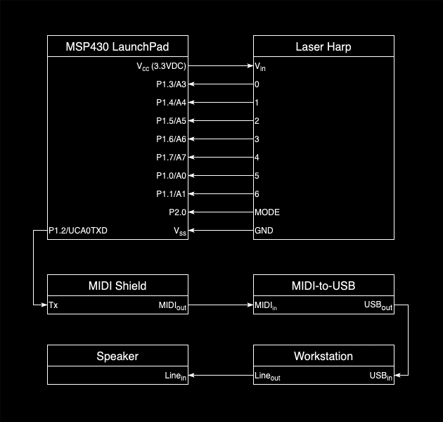

# MSP430 Laser Harp

Driven by a MSP430-series microcontroller, photo sensors are used in conjunction with laser diodes to create a MIDI instrument that can be played by "plucking" beams of light. Each sensor (mini photocell/photoresistor) has an individual laser pointed directly at it. Interruptions to the light source (i.e. the laser beam is blocked, or otherwise interfered with) will signal the MSP430 to process these events into MIDI signals, which are then transmitted out the microcontroller's UART port and through a MIDI adapter (MIDI Shield). Each MIDI signal carries a note on the C Major Scale correponding to the sensor that is triggered. Using a software interface, such as Ableton, these notes can then be recorded, assigned sounds, and played through an audio output device.

  

## Bill of Materials

| Item                                          | Supplier    |  Qty  |  Price |  Total |
| --------------------------------------------- | ----------- | :---: | -----: | -----: |
| MSP430G2553                                   | TI          |   1   | $15.95 | $15.95 |
| Prototyping Breadboard                        | IEEE        |   1   |  $3.00 |  $3.00 |
| M-F Jumper Wire                               | IEEE        |  N/A  |  $0.10 |    N/A |
| M-M Jumper Wire                               | IEEE        |  N/A  |  $0.10 |    N/A |
| MIDI-to-USB Cable                             | N/A         |   1   |    N/A |    N/A |
| MIDI Shield                                   | SparkFun    |   1   | $19.95 | $19.95 |
| Mini Photocell                                | SparkFun    |   7   |  $1.50 | $10.50 |
| 5mW Laser Emitter - Red Line                  | ElecFreaks  |   7   |  $0.50 |  $3.50 |
| ElecFreaks Resistor Kit D 5% Accuracy 2000Pcs | ElecFreaks  |   1   |  $8.98 |  $8.98 |
| Button Switch Circle Cap 5Pcs                 | ElecFreaks  |   1   |  $1.80 |  $1.80 |
| Cardboard Box                                 | Home Depot  |   1   |  $2.92 |  $2.92 |
| Styrofoam                                     | Home Depot  |   1   |  $7.56 |  $7.56 |
| Duct Tape                                     | Dollar Tree |   1   |  $1.00 |  $1.00 |

## Reference Material

* [MSP430G2553 Data Sheet](https://www.ti.com/lit/ds/symlink/msp430g2553.pdf)
* [MSP430 Light Harp w/ Example Code](http://wiesel.ece.utah.edu/redmine/projects/laserharp/wiki)
* [SparkFun MIDI Shield - GitHub](https://github.com/sparkfun/MIDI_Shield/)
* [MIDI Messages List - Status Bytes](https://midi.org/expanded-midi-1-0-messages-list)
